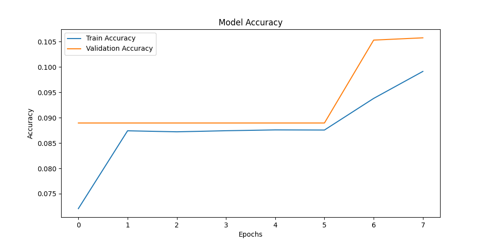
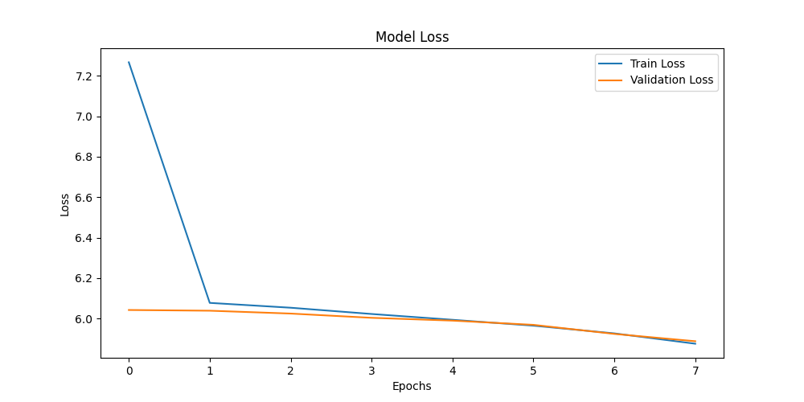
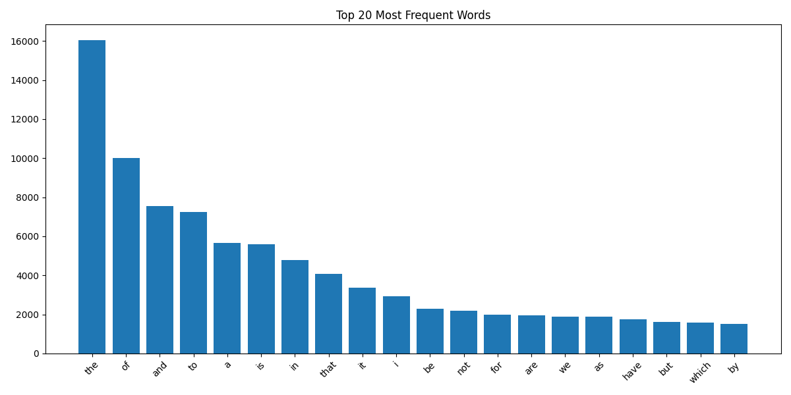
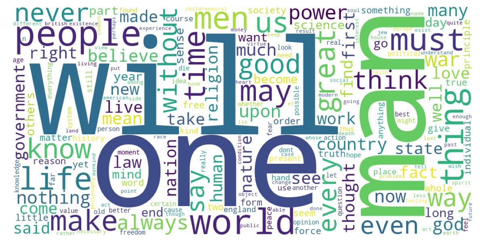

# Next Word Prediction using Deep Learning (Bi-LSTM)


---

## Project Overview

This project implements a **Next Word Prediction System** using **Natural Language Processing (NLP)** and **Deep Learning**. The model was trained on the WikiQuotes dataset to learn language patterns and predict the most probable next word based on user input.

The project demonstrates the complete AI workflow, including text preprocessing, exploratory data analysis (EDA), tokenization, sequence generation, model training, evaluation, and interactive prediction.

---

## Features

- Text Cleaning & Normalization
- Large-Scale Dataset Processing
- Exploratory Data Analysis (EDA)
- Word Frequency Analysis
- Word Cloud Generation
- Tokenization using Keras Tokenizer
- Sequence Generation
- Sequence Padding
- Bidirectional LSTM Model
- Early Stopping
- Model Checkpoint Saving
- Interactive Next Word Prediction
- Accuracy & Loss Visualization

---

## Technologies Used

- Python
- TensorFlow / Keras
- NumPy
- Pandas
- Matplotlib
- Scikit-learn
- WordCloud
- Pickle

---

# Project Structure

```text
Next-Word-Prediction/
│
├── dataset/
│   └── WikiQuotes.csv
│
├── graphs/
│   ├── accuracy.png
│   ├── loss.png
│   ├── top_words.png
│   └── wordcloud.png
│
├── models/
│   ├── best_model.keras
│   ├── tokenizer.pkl
│   └── max_len.pkl
│
├── config.py
├── preprocess.py
├── train.py
├── predict.py
├── requirements.txt
└── README.md
```

---

# Workflow

1. Load WikiQuotes Dataset
2. Clean and Normalize Text
3. Remove Missing & Duplicate Records
4. Perform Exploratory Data Analysis
5. Generate Top Words Graph
6. Generate Word Cloud
7. Tokenize Text
8. Generate Input Sequences
9. Apply Sequence Padding
10. Train Bidirectional LSTM Model
11. Save Trained Model
12. Predict Next Word

---

# Model Architecture

- Embedding Layer
- Bidirectional LSTM Layer
- Dropout Layer
- Dense Layer (ReLU)
- Softmax Output Layer

---

# Results

## Accuracy Graph

Click to view the full image.

[📈 Accuracy Graph](accuracy.png)



---

## Loss Graph

Click to view the full image.

[📉 Loss Graph](loss.png)



---

## Top Words Frequency

Click to view the full image.

[📊 Top Words](top_words.png)



---

## Word Cloud

Click to view the full image.

[☁️ Word Cloud](wordcloud.png)



---

# Installation

Clone the repository:

```bash
git clone https://github.com/your-username/Next-Word-Prediction.git
```

Install dependencies:

```bash
pip install -r requirements.txt
```

---

# Run the Project

### Step 1: Preprocess Dataset

```bash
python preprocess.py
```

### Step 2: Train Model

```bash
python train.py
```

### Step 3: Run Prediction

```bash
python predict.py
```

---

# Sample Prediction

**Input**

```
Artificial intelligence is
```

**Predicted Words**

```
1. changing
2. transforming
3. becoming
```

---

# Future Improvements

- Transformer-based Language Models
- GPT Architecture
- Beam Search Decoding
- Top-k Sampling
- Top-p Sampling
- Web-based User Interface
- REST API Deployment

---

# Author

**Hafsa Asif**

Computer Science Student

### Areas of Interest

- Artificial Intelligence
- Machine Learning
- Deep Learning
- Natural Language Processing
- Data Analysis

---

⭐ If you found this project helpful, consider giving it a star.
